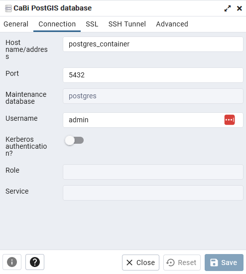

# Overview

These are the basic steps to recreate the analysis:

## Downloading CaBi Trip data
1. Download all CSV data of the trips
2. Write python functions to parse the data, count the number of trips between station pairs, and return a summary of the data

## Calculate the statistics 
1. Create a visualization using altair
2. Compile the altair to vega using the vegalite web viewer
3. Add the vega to a leaflet map and host it from github

## Setting up Valhalla server
1. download the GeoFabrik files for Virginia Maryland, and DC
2. Use OSMconvert to merge the files

# temp outline

## trip data and statistics

### read csvs

### get bidirectional time stats

### 

### get unique route counts

## set up PostGIS 

# the deets

## Using pandas to get route statistics

The commented code is available so I'm not going to go into too much detail here. Two tables are calculated - one that considers the direction of the trip, and another that just counts how many trips are between each station.

For a trip to be included, it must:
- Not have a 0 for the Start or End station
- remove trips with an end time BEFORE the start time
- not take longer than 4 hours. I've found the expected trip time of the longest trip possible is 3 hours. I assumed that any trips much longer than this are either not a single trip, or are a very slow, leasiurely trip that is not likely to follow the calculated 'shortest' route. This could be improved by removing trips that are significant slower than the expected trip between the station pair

## Setting up docker compose to host the various components

i want to use PostGIS to store the data, and pgadmin to browse the postgis server. Also, I need to build tiles that valhalla can use for routing. It is convenient to use docker to host these various components I need. 

The valhalla container is only used to build the tiles, since the container already has a nice built-in workflow to rebuild the tiles if anything changes in the input OSM data. 

## Setting up a routing server with valhalla
There are 60k+ unique trips in the dataset. To get an assumed route for each trip, we need to put each one through a routing program. There are a lot of routing services out there, either using their own proprietary data and closed-source methods (e.g. Google Maps), and some using free OSM data for street network data and open source routing programs to calculate the routes (e.g. pgRouting, OSRM, Valhalla, etc). Many of these are available via APIs, but with the amount of trips we want to route, it is easier just to create the routing system on our own hardware. 

We will be using Valhalla, because it offers excellent performance via a tiled routing system, and offers a sophisticated routing algorithm for bicycle trips. We will build the routing network using the valhalla Docker image, and then the actual routing will be done using a precompiled binary downloaded as part of the `pyvalhalla` package. 

### Downloading the OSM data

To create the routing system, the first step is to build a street network. Valhalla processes data from OpenStreetMap. You can either get this data by downloading a section from the Overpass API, or download it by state from GeoFabrik. I prefer the latter, because geofabrik data is already stripped author information and compiled to a space-saving binary format.

For this project we need the data for Virginia, The District of Columbia and Maryland. Download the PBFs from GeoFabrik and throw them in a subdirectory called states. To avoid building tiles for all of Virginia and Maryland, two very large states, we can create a subset in the area we want, and then combine them into one output .pbf file that will be used to build the tiles. 

To spatially subset and combine the tiles, we use a command line utilty called *osmconvert*, available in the *osmctools* package.

```shell
>>> sudo apt install osmctools -y
>>> osmconvert ..data/osm_data/states/district-of-columbia-latest.osm.pbf --out-o5m -b=-77.3724,38.7685,-76.8474,39.1599 \
 | osmconvert - ..data/osm_data/states/maryland-latest.osm.pbf --out-o5m -b=-77.3724,38.7685,-76.8474,39.1599 \
 | osmconvert - ..data/osm_data/states/district-of-columbia-latest.osm.pbf -b=-77.3724,38.7685,-76.8474,39.599 -o=all_dc_area.pbf
```

Now, we have a binary file containing the streets in the entire DC metro area. To build Valhalla routing tiles, we can relaunch the Valhalla docker container.  This might take a 20 or 30 minutes, so go get a cup of coffee.


## Setting up postgis database

### Set up pgadmin to use your postgis database

The pgadmin container hosts a webserver that lets us interact with the PostGIS database. To go there, point your browser to `localhost:8080/`. Once you have done that, you will need to tell pgadmin where our postgis database lives. Give it a name, then enter the name of the container hosting the databse (`postgres_container` in our case), and then enter the database password you have chosen. 

  

### Set up the PostGIS database structure
Now that pgadmin is talking to our databse, we need to set up some empty tables:  

 - A table called `station_info` to hold the data about each station. It will hold the short name, which is a unique ID for each station, the friendly name, the latitude and longitude, and a point geometry

```sql
create table cabi_stations
(
    short_name bigint,
    name text,
    lat double precision,
    lon double precision,
    geometry geometry(Point,4326)
);
```

The station data table is then populated using the `load_stations.py` file:
```
python load_stations.py
```
- A table called `route_stats` that will hold the number of trips between each station, and the time statistics of each trip.
```sql
create table route_stats
(
    index bigint,
    start_st_id integer,
    end_st_id integer,
    pop bigint
);
```
- A Table called `route_geometry` which will contain the actual route between stations as calculated by Valhalla.
```sql
create table route_geometry
(
    st bigint,
    en bigint,
    triptime double precision,
    tripdist double precision,
    geom geometry(LineString,26985)
);
```
### Set up PostGIS topology

To get the number of trips on each route, we will use a topologically defined geometry. We first have to activate this feature in the database:
```sql
CREATE EXTENSION postgis_topology;
```
The next step is to create an empty topology. The topology will be stored in the best coordinate system for DC, the Maryland State Plane South (EPSG 26985). We also included a certain tolerance to allow for some squish in the coordinate conversion or weirdness in OpenStreetMap data
```sql
-- allowing a tolerance of 0.15 to account for coordinate conversion
SELECT topology.CreateTopology('cabi_topo',26985,0.15);
```

##  Run every trip through the routing model using a python script

This could also be done in a point-and-click GIS like QGIS using the valhalla extension. However, we will use the valhalla python API. 

To get realistic routing, the costing parameters need to be set. I played with different configurations for a while until the results looked *the most similar* to the route I would take based on my many years biking in DC. 
```json
"costing_options": {
            "bicycle": {
                "bicycle_type": "hybrid",
                "use_roads": 0.1,
                "use_hills": 0.1,
                "use_ferry": 0,
            }
        },
```

When riding a heavy, slow CaBi bike, you're more inclined to avoid hills, and I assumed many cabi users are casual cyclists who try to avoid traffic to the extent possible, so I chose the parameters to **strongly** prefer bike trail over roads. Also, I don't know anyone in DC who might casually hop on a ferry to cross the Potomac, so I set the costing model avoid any ferry crossings. The final results look very realistic based on my judgement of areas i've spot-checked. A few major caveats apply:

- I based this on my judgement, you might prefer a different route
- I only routed the trips one way, then for the reverse trip I used the same route. For most cases, this will result in no or a very small diference. There are a number of trips where the ideal trip from A to B is going to be a different route than from B to A, especially in DC where one-way streets are common.
- I don't claim that these routes are anywhere near 100% accurate. They are a rough simulation, and we have no idea what route the trip actually took. I think that on the aggregate, they do give a good estimate of how much CaBi Bike traffic follows a particular street. They are probably more realistic in areas with a high density of trips. 
- The routing is deterministic with a given road network and trip, while in real life people might randomly choose a similar route for no discernible reason. One way to add a little more random variation, which I think would make the *aggregate* statistics more accurate is to randomly vary the parameters a small amount when doing the routing, or generate 3 possible routes and choose the best one at random. I'm going to keep things simple and just find the 'best' routing between two stations deterministically from the routing model 

The python script `valhalla_routing.py` runs the Valhalla algorithm for each trip pair and writes the results to the database. This takes about an hour to finish on my machine.

## Adding topological geometry to geodatabase
We set up a table that will hold the starting station, the ending station, and a topologically-defined geometry for the trip.

```sql
create table routes_topogeo
(
	rid serial primary key,
	st integer,
	en integer
);
select AddTopoGeometryColumn('cabi_topo', 'public', 'routes_topogeo', 'topogeom', 'LINE');
```

Once the topology information is created, the trips can be loaded in. This is a very slow operation because topology operations require many reads/writes to the topology table. I've found it is best down in chunks with an ANALYZE in between. I sorted them by distance first, with my thinking being that the longer trips would take longer to add to the topology tables, and that after I got the longest trips loaded I could make the chunk size a lot bigger. There might be a more efficient way to sort them - this requires a little more investigation.

The query to load the trips in chunks is:

```sql
analyze;
-- add a subquery that sorts by distance and then adds the row number
with 
aa as (
select st,en,geom,row_number() over (order by tripdist desc) as rid from station_routes
)
insert into routes_topogeo(rid,st,en,topogeom)
select aa.rid,aa.st,aa.en,toTopoGeom(aa.geom,'cabi_topo',1,0.1) from aa where aa.rid >10000 and aa.rid<=15000
```
Since this operation is so painfully slow, I'm working on optimizing it. I'm not a database whiz by any means, and I'm open to suggestions. One thing I'm thinking is that this query could be written using python and psychopg2, and possibly optimized to run in parallel. 

Some other possible improvements:
- create a unique ID for each station combo, maybe add a serial field to 

